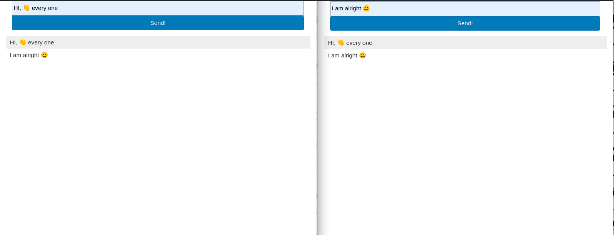

# Chat 

## Description
This is a chat app built with socket.io

The website provides more information about the tour as well as view the different gameparks available on the tour.

## Built With

- Socket.io
- HTML
- Css
- Javascript

## Live Demo

[Live Demo Link](https://matovu-farid.github.io/Chat )

## Video Descrption

## Getting Started

To get the content of this project locally you need to run this command in your terminal:

- git clone your https://github.com/matovu-farid/nativeWs 
- cd project nativeWs

## Authors

👤 **Matovu Farid Nkoba**

- GitHub: [@matovu-farid](https://github.com/matovu-farid)
- Twitter: [@matovu100](https://twitter.com/matovu100)
- LinkedIn: [matovu-farid](https://www.linkedin.com/in/matovu-farid-48b80257)

## ⭐️ Acknowledgement
- [original design idea by Cindy Shin in Behance](https://www.behance.net/adagio07)

## 🤝 Contributing

Contributions, issues, and feature requests are welcome!

Feel free to check the [issues page](../../issues/).

## Show your support

Give a ⭐️ if you like this project!

## 📝 License

This project is [MIT](./MIT.md) licensed.